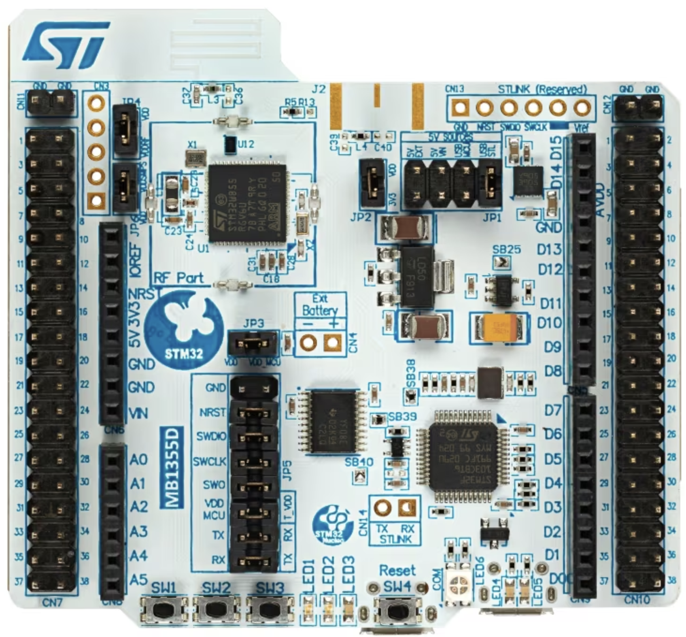

# STM32WB55_Nucleo-64_Examples
- Board Code: ...
- MCU: STM32WB55RGV6U 68 PINS
- IDE used: STM32CubeIDE 1.16.0

Useful links:  
- https://www.st.com/content/st_com/en/support/learning/stm32-education/stm32-online-training/stm32wb-online-training.html

### Projects:
| S.No. | Project                           | Short-Info            |
|-------|-----------------------------------| --------------------  |
| 1     | LED_Blink                         | ...                   |

### STM32F0-Discovery-Board
  

[Image source: https://www.st.com/en/evaluation-tools/nucleo-wb55rg.html]
